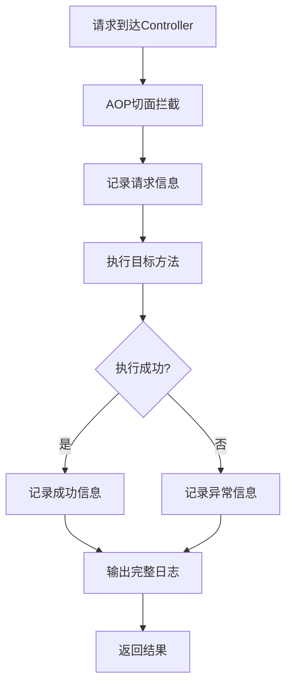

# Spring Boot AOP 日志记录教程

## 📚 什么是 AOP？

**AOP (Aspect-Oriented Programming)** 面向切面编程，是一种编程范式，它允许我们将横切关注点（如日志记录、安全检查、事务管理等）从业务逻辑中分离出来。

### 🔍 为什么要用 AOP 记录日志？

**传统方式的问题：**
```java
@GetMapping("/user/{id}")
public User getUserById(@PathVariable Long id) {
    log.info("开始查询用户，ID: {}", id);
    long startTime = System.currentTimeMillis();
    
    try {
        User user = userService.findById(id);
        long executeTime = System.currentTimeMillis() - startTime;
        log.info("查询用户成功，耗时: {}ms, 结果: {}", executeTime, user);
        return user;
    } catch (Exception e) {
        log.error("查询用户失败，ID: {}, 错误: {}", id, e.getMessage());
        throw e;
    }
}
```

**问题：**
- 每个方法都要写重复的日志代码
- 业务代码和日志代码混在一起
- 维护困难，容易遗漏

**AOP 方式：**
```java
@GetMapping("/user/{id}")
@WebLog(value = "根据ID查询用户", logArgs = true, logResult = true, logTime = true)
public User getUserById(@PathVariable Long id) {
    return userService.findById(id);  // 只关注业务逻辑
}
```

**优势：**
- 业务代码简洁
- 日志逻辑统一管理
- 可以灵活控制记录内容

## 🏗️ 项目结构

```
src/main/java/com/xkcoding/swagger/
├── annotation/
│   └── WebLog.java              # 自定义注解
├── aspect/
│   └── WebLogAspect.java        # AOP 切面类
├── entity/
│   └── WebLogInfo.java          # 日志信息实体
└── controller/
    ├── LogDemoController.java   # 日志示例控制器
    └── UserController.java      # 已添加日志注解的用户控制器
```

## 🔧 核心组件详解

### 1. @WebLog 注解

```java
@WebLog(
    value = "方法描述",           // 日志描述
    logArgs = true,             // 是否记录请求参数
    logResult = true,           // 是否记录返回结果
    logTime = true,             // 是否记录执行时间
    logException = true         // 是否记录异常信息
)
```

**使用场景：**
- `value`: 描述这个方法的业务功能
- `logArgs`: 需要调试参数时开启
- `logResult`: 需要查看返回值时开启
- `logTime`: 性能监控时开启
- `logException`: 异常排查时开启

### 2. WebLogAspect 切面

**核心概念：**
- **切点 (Pointcut)**: 定义在哪些方法上应用AOP
- **通知 (Advice)**: 定义何时执行AOP逻辑
- **连接点 (Join Point)**: 方法执行的具体时机

**执行流程：**


### 3. 日志输出格式

```
========================= Web Log Start =========================
请求ID: a1b2c3d4e5f6g7h8
请求时间: 2024-12-19T14:30:25.123
请求方法: POST
请求URL: http://localhost:8089/demo/user
请求URI: /demo/user
客户端IP: 192.168.1.100
目标类: UserController
目标方法: post
方法描述: 添加新用户
请求参数: 方法参数: [User(id=null, name=张三, job=前端开发)]
执行时间: 15ms
执行状态: SUCCESS
返回结果: User(id=999, name=张三, job=前端开发)
========================= Web Log End ===========================
```

## 🚀 快速上手

### 第1步：启动项目
```bash
mvn -DskipTests spring-boot:run -Dspring-boot.run.fork=true
```

### 第2步：访问 Swagger 文档
打开 `http://localhost:8089/demo/swagger-ui.html#/`

### 第3步：测试示例接口

#### 基础测试
```bash
# 1. 简单GET请求
curl "http://localhost:8089/demo/log-demo/simple"

# 2. 带参数的GET请求
curl "http://localhost:8089/demo/log-demo/with-params?name=张三&age=25"

# 3. POST请求（JSON体）
curl -X POST "http://localhost:8089/demo/log-demo/with-body" \
  -H "Content-Type: application/json" \
  -d '{"name":"李四","job":"后端开发"}'
```

#### 进阶测试
```bash
# 4. 测试执行时间记录
curl "http://localhost:8089/demo/log-demo/slow-method"

# 5. 测试异常记录
curl "http://localhost:8089/demo/log-demo/error-demo?throwError=true"

# 6. 测试选择性日志
curl -X PUT "http://localhost:8089/demo/log-demo/selective-log" \
  -H "Content-Type: application/json" \
  -d '{"test":"data"}'

# 7. 无日志记录的对比
curl "http://localhost:8089/demo/log-demo/no-log"
```

### 第4步：查看控制台日志

在你的终端中观察日志输出，对比不同配置的效果。

## 📖 学习指南

### 初学者路径

1. **理解基础概念**
   - 先运行简单示例，观察日志输出
   - 理解 @WebLog 注解的作用
   - 对比有无注解的区别

2. **掌握注解参数**
   - 尝试不同的 logArgs/logResult/logTime 组合
   - 观察日志内容的变化
   - 理解每个参数的作用

3. **分析切面代码**
   - 查看 WebLogAspect.java 的实现
   - 理解 @Around 通知的执行流程
   - 学习如何获取请求信息

4. **实践应用**
   - 在自己的 Controller 方法上添加 @WebLog
   - 根据业务需要调整记录内容
   - 优化日志格式和性能

### 进阶学习

1. **性能优化**
   - 异步日志记录
   - 日志内容压缩
   - 条件性记录

2. **扩展功能**
   - 日志持久化到数据库
   - 集成链路追踪
   - 告警机制

3. **其他切面应用**
   - 权限检查
   - 参数校验
   - 缓存管理

## 🛠️ 实用技巧

### 1. 生产环境配置

```yaml
# application-prod.yml
logging:
  level:
    com.xkcoding.swagger.aspect: INFO  # 生产环境建议用 INFO
  pattern:
    console: "%d{yyyy-MM-dd HH:mm:ss} [%thread] %-5level %logger{36} - %msg%n"
```

### 2. 日志级别控制

```java
@WebLog(value = "敏感操作", logArgs = false, logResult = false)  // 生产环境不记录敏感信息
public ApiResponse<String> sensitiveOperation(@RequestBody SensitiveData data) {
    // 业务逻辑
}
```

### 3. 性能监控

```java
@WebLog(value = "性能关键方法", logTime = true, logArgs = false, logResult = false)
public ApiResponse<String> performanceCritical() {
    // 只关注执行时间，不记录参数和结果
}
```

### 4. 调试模式

```java
@WebLog(value = "调试模式", logArgs = true, logResult = true, logException = true)
public ApiResponse<String> debugMode() {
    // 开发调试时记录详细信息
}
```

## ❓ 常见问题

### Q1: 为什么有些方法没有记录日志？
**A:** 检查是否添加了 @WebLog 注解，AOP 只会拦截有注解的方法。

### Q2: 日志太多影响性能怎么办？
**A:** 
- 选择性记录：关闭不必要的 logArgs/logResult
- 调整日志级别：生产环境用 INFO，开发环境用 DEBUG
- 异步日志：使用 Logback 的异步 Appender

### Q3: 如何记录数据库操作日志？
**A:** 
```java
@WebLog(value = "用户数据库操作", logArgs = true, logTime = true)
@Transactional
public User saveUser(User user) {
    return userRepository.save(user);
}
```

### Q4: 能否记录到数据库？
**A:** 可以！修改 WebLogAspect，添加数据库保存逻辑：
```java
@Autowired
private WebLogService webLogService;

private void printLog(WebLogInfo logInfo) {
    // 控制台输出
    log.info("...");
    
    // 异步保存到数据库
    webLogService.saveLogAsync(logInfo);
}
```

## 🎯 练习任务

### 任务1：基础练习
1. 在 UserController 的其他方法上添加 @WebLog 注解
2. 测试不同参数组合的效果
3. 观察异常情况下的日志记录

### 任务2：进阶练习
1. 创建一个新的 Controller，实现文件上传功能，并添加日志记录
2. 修改日志格式，添加更多信息（如请求头）
3. 实现条件性日志记录（根据用户角色决定是否记录）

### 任务3：实战练习
1. 将日志信息保存到数据库
2. 创建日志查询接口，支持分页和筛选
3. 实现日志统计功能（接口调用次数、平均响应时间等）

## 📚 相关资源

- [Spring AOP 官方文档](https://docs.spring.io/spring-framework/docs/current/reference/html/core.html#aop)
- [AspectJ 注解参考](https://www.eclipse.org/aspectj/doc/next/aspectj5rt-api/index.html)
- [Logback 配置指南](http://logback.qos.ch/manual/configuration.html)

---

**🎉 恭喜！你已经掌握了 Spring Boot AOP 日志记录的基础知识。现在开始实践，在你的项目中应用这些技能吧！**
